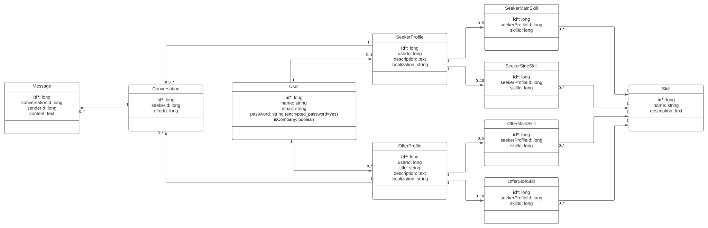

# Technical Specifications - Adopte un Candidat [Team 3]

## Document Control

### Document Information

|                   | Information |
| ----------------- | ----------- |
| Document Owner    | Maxime CARON|
| Creation Date     | 2024/05/17  |
| Last Update Date  | 2024/05/17  |
| Document Name     | Technical Specifications - Adopte un Candidat [Team 3]|

### Document Versions

| Version n°  | Author       | Date       | Description of edits |
| ----------- | ------------ | ---------- | -------------------- |
| 0.01        | Maxime CARON | 11/08/2023 | Initial Version with plan and basics |

### Document Approvals
| Role               | Name             | Date  |
| ------------------ | ---------------- | ----- |
| Project Manager    | Lucas AUBARD     |       |
| Technical Leader   | Maxime CARON     |       |
| Program Manager    | Habi CAILLEAU    |       |
| Quality Assurance  | Clémentine Curel |       |
| Technical Writer   | Alexis LASSELIN  |       |
| Software Engineer  | Thibaud MARLIER  |       |


## Table of Contents

<details>
<summary><b>Click to expand</b></summary>

- [Technical Specifications - Adopte un Candidat \[Team 3\]](#technical-specifications---adopte-un-candidat-team-3)
  - [Document Control](#document-control)
    - [Document Information](#document-information)
    - [Document Versions](#document-versions)
    - [Document Approvals](#document-approvals)
  - [Table of Contents](#table-of-contents)
  - [I. Introduction](#i-introduction)
    - [1. Glossary](#1-glossary)
    - [2. Document Purpose](#2-document-purpose)
    - [3. Project Definition](#3-project-definition)
      - [**A. Vision**](#a-vision)
      - [**B. Goals and Objectives**](#b-goals-and-objectives)
        - [➭ General Features:](#-general-features)
        - [➭ Company Side:](#-company-side)
        - [➭ Job Seeker Side:](#-job-seeker-side)
      - [**C. Future Improvements**](#c-future-improvements)
      - [**D. Assumptions**](#d-assumptions)
  - [II. Technology Presentation](#ii-technology-presentation)
    - [1. Flutter](#1-flutter)
      - [**A. Definition and Usage**](#a-definition-and-usage)
      - [**B. Used Packages**](#b-used-packages)
        - [➭ Development Packages:](#-development-packages)
        - [➭ Testing Packages:](#-testing-packages)
      - [**C. Working Environment**](#c-working-environment)
          - [➭ Usage:](#-usage)
          - [➭ Installation:](#-installation)
    - [2. Firebase](#2-firebase)
      - [**A. Definition and Usage**](#a-definition-and-usage-1)
        - [➭ Definition:](#-definition)
        - [➭ Usage:](#-usage-1)
      - [**B. Working Environment**](#b-working-environment)
  - [III. Technical Specification](#iii-technical-specification)
    - [1. Coding Conventions](#1-coding-conventions)
      - [A. Folder Structure](#a-folder-structure)
        - [➭ Structure:](#-structure)
        - [➭ Files and Folders Naming Conventions:](#-files-and-folders-naming-conventions)
        - [➭ Folder details:](#-folder-details)
      - [B. Comments](#b-comments)
        - [➭ Comments at File Beginning:](#-comments-at-file-beginning)
        - [➭ Comments in the Code:](#-comments-in-the-code)
      - [C. Code Structure](#c-code-structure)
        - [➭ Indentation:](#-indentation)
        - [➭ Spacing:](#-spacing)
        - [➭ Naming Conventions:](#-naming-conventions)
    - [2. Database](#2-database)
      - [A. Data Model Overview](#a-data-model-overview)
      - [B. Table Details and Usage](#b-table-details-and-usage)
        - [➭ User:](#-user)
        - [➭ SeekerProfile:](#-seekerprofile)
        - [➭ OfferProfile:](#-offerprofile)
        - [➭ SeekerMainSkill:](#-seekermainskill)
        - [➭ SeekerSideSkill:](#-seekersideskill)
        - [➭ OfferMainSkill:](#-offermainskill)
        - [➭ OfferSideSkill:](#-offersideskill)
        - [➭ Skill:](#-skill)
        - [➭ Conversation:](#-conversation)
        - [➭ Message:](#-message)
      - [C. Interaction From the Application](#c-interaction-from-the-application)
        - [➭ Interaction Times:](#-interaction-times)
        - [➭ Data structurations:](#-data-structurations)
        - [➭ Ways to interact:](#-ways-to-interact)
      - [D. Future Improvements of the Database](#d-future-improvements-of-the-database)
    - [3. Graphic Conventions](#3-graphic-conventions)
      - [A. Colors](#a-colors)
      - [B. Typography](#b-typography)
    - [4. Widgets](#4-widgets)
      - [A. Buttons](#a-buttons)
      - [B. Fields](#b-fields)
      - [C. Menus](#c-menus)
    - [5. Pages](#5-pages)
      - [A. Login and Subscription](#a-login-and-subscription)
      - [B. Company Side](#b-company-side)
      - [C. Job Seeker Side](#c-job-seeker-side)
    - [6. Matching Algorithm](#6-matching-algorithm)
  - [IV. Further Considerations](#iv-further-considerations)
    - [1. Issues and Impact](#1-issues-and-impact)
    - [2. Considerations](#2-considerations)
  - [V. Work](#v-work)
    - [1. Work](#1-work)
</details>

## I. Introduction

### 1. Glossary

| Term             | Definition | Source |
| ---------------- | ---------- | ------ |
| Flutter          |            |        |
| Firebase         |            |        |
| API              |            |        |
| Database         |            |        |
| Widget           |            |        |
| Page             |            |        |
| Matching         |            |        |
| Chat             |            |        |

### 2. Document Purpose

The purpose of this document is to expand upon the functional specifications by defining the features, scope, and objectives of the project. It provides detailed explanations of how each feature works and serves as a comprehensive guide for the development team and other team members who need an in-depth understanding of the application.

It is highly recommended to read the  [Functional Specifications](../FunctionalSpecification/FunctionalSpecification.md) before proceeding with this document.

This document serves as a reference for the development team to understand the technical requirements of the project, ensuring that the project is developed in alignment with the specified guidelines.

Additionally, it provides resources on coding conventions, database structure, graphic standards, and other aspects crucial to the maintainability and scalability of the application.

The ultimate goal is to provide We Are Evolution, the client of the project, with a clear understanding of how the application functions and how it can be further developed and maintained.

### 3. Project Definition

The project is a mobile and web application that aims to connect job seekers with companies. The application is designed to be similar to "Tinder," where job seekers and companies can swipe on each other to match. The application will also include a chat feature to allow matched users to communicate.

This application will be developed for We Are Evolution, with the primary requirement being to use Flutter and create a "Tinder"-like application.

#### **A. Vision**

As the client has given us considerable freedom in the application design and features, we decided to create an application that is innovative and engaging. Most job-seeking applications are boring, have a cold design, and are not user-friendly. We aim to create a fun and easy-to-use application that will make the job-seeking process more enjoyable.

#### **B. Goals and Objectives**

Our main goal is to create a Flutter application that allows job seekers and companies to match with each other. The usage of Flutter allows us to export the project as a web application after the mobile application is done.

The application will have two distinct sides:
- The company side, where companies can create a profile, set their preferences, add job offers, and swipe on job seekers.
- The job seeker side, where job seekers can create a profile, set their preferences, and swipe on companies.

##### ➭ <ins>General Features:</ins>
- Account settings: Job seekers and companies can change their account settings.
- Algorithm: The application must include a matching algorithm to match job seekers and companies.

##### ➭ <ins>Company Side:</ins>

The company side will have the following features:
- Profile: Companies can create a profile with the ability to manage various job offers they have.
- Swipe Area: Companies can swipe on job seekers.
- Chat: Companies can chat with job seekers they are matched with and differentiate them through the job offers they have matched with.

##### ➭ <ins>Job Seeker Side:</ins>

The job seeker side will have the following features:
- Profile: Job seekers can create a profile with various fields to personalize their profile.
- Swipe Area: Job seekers can swipe on companies.
- Chat: Job seekers can chat with companies they are matched with.


#### **C. Future Improvements**

The first version of the application will not contain all the features we would like to implement. Here are some of the features we would like to add in the future:
- An API to allow the application to interact with a database.
- Email verification to ensure that every user is a real person.
- Tests to ensure that every information given by the user is correct like testing if the company is real or if the job seeker is a real person.
- Testing job seekers' skills to ensure that they are qualified for the job they are applying for.

#### **D. Assumptions**

We are assuming that the application will be used by real companies and job seekers. We are also assuming that the application will be used professionally and that the users will not use the chat feature to send inappropriate messages.

## II. Technology Presentation

### 1. Flutter

#### **A. Definition and Usage**

For this project, it's mandatory to use Flutter. Flutter is an open-source UI software development kit created by Google. It is used to develop applications for Android, iOS, Linux, Mac, Windows, Google Fuchsia, and the web from a single codebase.

We will use Flutter to create the mobile application for We Are Evolution. Flutter is a great tool for creating mobile applications as it allows the creation of a single codebase for both Android and iOS applications. It also allows the creation of beautiful and responsive applications.

#### **B. Used Packages**

To create the application, we will need to use some packages.

##### ➭ <ins>Development Packages:</ins>
- `flutter/material.dart`: The Flutter material package provides a set of widgets that implement the Material Design guidelines. These widgets are used to create the user interface of the application.
- `firebase_core/firebase_core.dart`: The Firebase Core package provides the core functionality of Firebase services. It is used to initialize Firebase in the application.
- `firebase_database/firebase_database.dart`: The Firebase Database package provides access to the Firebase Realtime Database. It is used to interact with the database in the application.
- `firebase_auth/firebase_auth.dart`: The Firebase Auth package provides access to Firebase Authentication. It is used to authenticate users in the application.

##### ➭ <ins>Testing Packages:</ins>
- `flutter_observatory`: A package that provides a testing framework for Flutter applications.
- `mockito`: A package that provides a mock library for Dart.
- `flutter_test`: A package that provides unit testing for Flutter applications.
- `flutter_driver`: A package that provides integration testing for Flutter applications.
- `widget_tester`: A package that provides widget testing for Flutter applications.

#### **C. Working Environment**

###### ➭ <ins>Usage:</ins>

To work on the project, we will need to have a suitable working environment. Here is the working environment we will use:
- **Flutter SDK:** The Flutter SDK is the software development kit that allows us to create Flutter applications. We will use the latest version of the Flutter SDK to create the application.
- **Visual Studio Code:** Visual Studio Code is the integrated development environment that allows us to create Flutter applications.
- **Android Studio:** Android Studio is the integrated development environment that allows us to create Android applications. We will use Android Studio to create various virtual devices to test the application.


###### ➭ <ins>Installation:</ins>

For a complete installation guide, please refer to the [Flutter documentation](https://flutter.dev/docs/get-started/install).
Or follow the following video tutorials: 
- [Flutter Installation for Windows](https://youtube.com/playlist?list=PL82uaKJraAIJ0g3z076X2Gb2or05_xGAZ&si=O3KmoeAdGNZWOyOU).
- [Flutter Installation for MacOS](https://youtube.com/playlist?list=PL82uaKJraAII8HJjA98l-M6qb_teI97kW&si=sIDT-y6wrXq-l9Ei).

### 2. Firebase

#### **A. Definition and Usage**

##### ➭ <ins>Definition:</ins>
Firebase is a comprehensive app development platform by Google that provides a variety of tools and services to help developers build high-quality applications quickly. It offers backend services such as real-time databases, authentication, crash reporting, analytics, cloud storage, and hosting, among others.

##### ➭ <ins>Usage:</ins>
- **Real-time Database:** Firebase Realtime Database stores and syncs data in real-time across all clients. This is particularly useful for applications that require frequent updates, such as chat apps or collaborative tools.
- **Authentication:** Firebase Authentication provides easy-to-use SDKs and backend services to authenticate users with passwords, phone numbers, and popular federated identity providers like Google, Facebook, and Twitter.

#### **B. Working Environment**

Firebase integrates seamlessly with your existing working environment, whether you are developing for mobile (iOS, Android) or web applications. Here’s a brief overview of setting up and working with Firebase:

1. **Project Setup:**
  - Sign into Firebase using a Google account.
    - *Notice: that you need to accept the Firebase terms and conditions before proceeding ([here](https://console.cloud.google.com/)).*
  - Install Firebase CLI to manage your Firebase projects from the command line (more details [here](https://firebase.google.com/docs/cli#setup_update_cli)).
    - *Notice: that it is easier for later use to install it with npm: `npm install -g firebase-tools`.*
  - Login to Firebase CLI using `firebase login`.
    - *Notice: that you don't need to do it if you haven’t already during the installation process.*
  - Install FlutterFire CLI by running `flutter pub global activate flutterfire_cli` in your terminal.
    - *More details [here](https://firebase.google.com/docs/flutter/setup?platform=android).*
  - Configure your app to use Firebase by running `flutterfire configure` in a terminal in your project directory.
    - *Notice: that you may need to restart your computer before running this to ensure that your PATH variables are up-to-date.*
  - From your Flutter project directory, install the core plugin by running `flutter pub add firebase_core`.
  - From your Flutter project directory, ensure that your Flutter app's Firebase configuration is up-to-date by running `flutterfire configure`.
  - In your lib/main.dart file, import the Firebase core plugin and the configuration file you generated earlier:
     ```dart
     import 'package:firebase_core/firebase_core.dart';
     import 'firebase_options.dart';
     ```
  - Also in your lib/main.dart file, initialize Firebase using the DefaultFirebaseOptions object exported by the configuration file:
      ```dart
      await Firebase.initializeApp(
        options: DefaultFirebaseOptions.currentPlatform,
      );
      ```
  - Run your app to ensure that Firebase is correctly initialized.

</br>

*Complete installation and setup instructions can be found in the [Firebase documentation](https://firebase.google.com/docs/flutter/setup?platform=android).*

## III. Technical Specification

### 1. Coding Conventions

#### A. Folder Structure

##### ➭ <ins>Structure:</ins>
The project's folder structure provides a foundational framework for organizing code files. While it may evolve, the initial structure serves as a solid starting point:
```plaintext
lib/
  ├── main.dart
  ├── models/
  │     ├── user.dart
  │     ├── company.dart
  │     ├── chat.dart
  │     ├── message.dart
  ├── services/
  │     ├── authentication.dart
  │     ├── database.dart
  │     ├── matching.dart
  ├── widgets/
  │     ├── buttons/
  │     │     ├── text_button.dart
  │     │     ├── icon_button.dart
  │     ├── fields/
  │     │     ├── text_field.dart
  │     │     ├── localization_field.dart
  │     │     ├── tag_field.dart
  │     ├── menus/
  │     │     ├── menu.dart
  │     │     ├── dropdown_menu.dart
  ├── pages/
  │     ├── login.dart
  │     ├── subscription.dart
  │     ├── company/
  │     │     ├── profile.dart
  │     │     ├── settings.dart
  │     │     ├── swap_area.dart
  │     │     ├── chat.dart
  │     ├── job_seeker/
  │     │     ├── profile.dart
  │     │     ├── settings.dart
  │     │     ├── swap_area.dart
  │     │     ├── chat.dart
  ├── matching_algorithm.dart
```
This structured layout facilitates code organization and enhances project maintainability.

##### ➭ <ins>Files and Folders Naming Conventions:</ins>
To maintain consistency and make it easier to navigate through the code, we will use the same naming conventions as the one used by default in Flutter. We will use snake_case for files and folder names. This will make it easier to read and understand the code.

##### ➭ <ins>Folder details:</ins>

- **`models/`:** This folder will contain all the models used in the application. Each model will be in a separate file.
- **`services/`:** This folder will contain all the services used in the application. Each service will be in a separate file.
- **`widgets/`:** This folder will contain all the widgets used in the application. Each widget will be in a separate file.
- **`pages/`:** This folder will contain all the pages used in the application. Each page will be in a separate file.

#### B. Comments

Effective comments provide insights into the purpose and functionality of code segments. We adhere to clear commenting conventions to aid understanding and collaboration:

##### ➭ <ins>Comments at File Beginning:</ins>
At the beginning of each file, a concise comment provides an overview of its contents and purpose:

*Example:*
```dart
// User model: Contains user-related data and functionality.
```

##### ➭ <ins>Comments in the Code:</ins>
Throughout the codebase, comments elucidate logic, function purpose, parameters, and return values, fostering comprehension and ease of maintenance:

*Example:*

**Before a function:**
```dart
// Adds two numbers and returns the result.
// Parameters:
// - num1: The first number.
// - num2: The second number.
// Returns: The sum of num1 and num2.
int add(int num1, int num2) {
  return num1 + num2;
}
```

**Inside a function:**
```dart
// Check if the user is authenticated.
if (isAuthenticated) {
  // If the user is authenticated, show the home page.
  showHomePage();
} else {
  // If the user is not authenticated, show the login page.
  showLoginPage();
}
```

#### C. Code Structure

Structured code enhances readability and maintainability. We employ consistent indentation, spacing, and naming conventions:

##### ➭ <ins>Indentation:</ins>
We use 2-space indentation to ensure clear code hierarchy and readability:

*Example:*
```dart
void main() {
  print('Hello, World!');
}
```
##### ➭ <ins>Spacing:</ins>
Consistent spacing around commas and operators aids code legibility:

*Example:*
```dart
int add(int num1, int num2) {
  return num1 + num2;
}
```

##### ➭ <ins>Naming Conventions:</ins>
We adopt camelCase for variable and function names, promoting clarity and consistency:

*Example:*
```dart
int calculateTotalPrice(int unitPrice, int quantity) {
  return unitPrice * quantity;
}
```

### 2. Database

#### A. Data Model Overview

The application will use Firebase Realtime Database to store and sync data in real-time across all clients. The data model will consist of the following tables:



(See a larger version [here](TechnicalSpecificationAppendix/Database_V2_UML.pdf))

#### B. Table Details and Usage

##### ➭ <ins>User:</ins>
- **Fields:**
  - `id`: Unique identifier of the user.
  - `name`: Name of the user.
  - `email`: Email of the user.
  - `password`: Password of the user.
  - `isCompany`: User type (company or job seeker).

##### ➭ <ins>SeekerProfile:</ins>
- **Fields:**
  - `id`: Unique identifier of the seeker profile.
  - `userId`: Unique identifier of the user.
  - `localization`: Localization of the job seeker.

##### ➭ <ins>OfferProfile:</ins>
- **Fields:**
  - `id`: Unique identifier of the offer profile.
  - `userId`: Unique identifier of the user.
  - `title`: Title of the job offer.
  - `description`: Description of the job offer.
  - `localization`: Localization of the job offer.

##### ➭ <ins>SeekerMainSkill:</ins>
- **Fields:**
  - `id`: Unique identifier of the seeker main skill.
  - `seekerProfileId`: Unique identifier of the job seeker profile.
  - `skillId`: Unique identifier of the skill.

##### ➭ <ins>SeekerSideSkill:</ins>
- **Fields:**
  - `id`: Unique identifier of the seeker side skill.
  - `seekerProfileId`: Unique identifier of the job seeker profile.
  - `skillId`: Unique identifier of the skill.

##### ➭ <ins>OfferMainSkill:</ins>
- **Fields:**
  - `id`: Unique identifier of the offer main skill.
  - `offerProfileId`: Unique identifier of the job offer profile.
  - `skillId`: Unique identifier of the skill.

##### ➭ <ins>OfferSideSkill:</ins>
- **Fields:**
  - `id`: Unique identifier of the offer side skill.
  - `offerProfileId`: Unique identifier of the job offer profile.
  - `skillId`: Unique identifier of the skill.

##### ➭ <ins>Skill:</ins>
- **Fields:**
  - `id`: Unique identifier of the skill.
  - `name`: Name of the skill.
  - `description`: Description of the skill.

##### ➭ <ins>Conversation:</ins>
- **Fields:**
  - `id`: Unique identifier of the conversation.
  - `seekerId`: Unique identifier of the job seeker.
  - `offerId`: Unique identifier of the job offer.

##### ➭ <ins>Message:</ins>
- **Fields:**
  - `id`: Unique identifier of the message.
  - `conversationId`: Unique identifier of the conversation.
  - `senderId`: Unique identifier of the user who sent the message.
  - `content`: Content of the message.

#### C. Interaction From the Application 

##### ➭ <ins>Interaction Times:</ins>

The application will interact with the database at the following moments:
- **Authentication:** The application will use Firebase Authentication to:
  - Sign in users.
  - Sign out users.
  - Create new user accounts.
- **App Launch:** Once the user is authenticated, the application will use the database to:
  - Retrieve user profiles.
  - Retrieve seeker profiles.
  - Retrieve offer profiles.
- **Profile Update:** The application will use the database to:
  - Update user profiles.
  - Update seeker profiles.
  - Update offer profiles.
- **Swipe Proposals:** The matching algorithm will use the database to:
  - Propose job offers to job seekers.
  - Propose job seekers to companies.
- **Chat:** The application will use the database to:
  - Create conversations.
  - Send messages.
  - Retrieve messages.

##### ➭ <ins>Data structurations:</ins>
// TODO: Add more details about how the data will be structured in the database.

##### ➭ <ins>Ways to interact:</ins>

// TODO: Add more details about how the application will interact with the database.

#### D. Future Improvements of the Database
The project is currently a proof of concept for a company, which is why we are using Firebase as a prototype database. In the future, the company will be free to use any other database with any other API to meet the evolving requirements of the application.


### 3. Graphic Conventions 

#### A. Colors
// TODO: Define the color palette of the application and how each color will be used.

#### B. Typography
// TODO: Define the typography of the application and how each font will be used.

### 4. Widgets


#### A. Buttons
- Text Buttons
- Icon Buttons
#### B. Fields
- Text Field
- Localization Field
- Tag Field
#### C. Menus

### 5. Pages

#### A. Login and Subscription

#### B. Company Side
- Profile
- Settings
- Swap Area
- Chat
#### C. Job Seeker Side
- Profile
- Settings
- Swap Area
- Chat
### 6. Matching Algorithm

## IV. Further Considerations

### 1. Issues and Impact

### 2. Considerations

## V. Work

### 1. Work