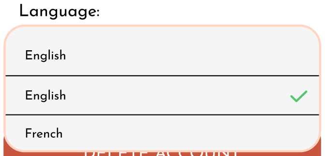

# Technical Specifications - Adopte un Candidat [Team 3]

## Document Control

### Document Information

|                   | Information |
| ----------------- | ----------- |
| Document Owner    | Maxime CARON|
| Creation Date     | 2024/05/17  |
| Last Update Date  | 2024/05/22  |
| Document Name     | Technical Specifications - Adopte un Candidat [Team 3]|

### Document Versions

| Version n°  | Author       | Date       | Description of edits |
| ----------- | ------------ | ---------- | -------------------- |
| 0.01        | Maxime CARON | 2024/05/15 | Initial Version with plan and basics |
| 0.02        | Maxime CARON | 2024/05/21 | Added the first part of the document |

### Document Approvals
| Role               | Name             | Date  |
| ------------------ | ---------------- | ----- |
| Project Manager    | Lucas AUBARD     |       |
| Technical Leader   | Maxime CARON     |       |
| Program Manager    | Habi CAILLEAU    |       |
| Quality Assurance  | Clémentine Curel |       |
| Technical Writer   | Alexis LASSELIN  |       |
| Software Engineer  | Thibaud MARLIER  |       |


## Table of Contents

<details>
<summary><b>Click to expand</b></summary>

- [Technical Specifications - Adopte un Candidat \[Team 3\]](#technical-specifications---adopte-un-candidat-team-3)
  - [Document Control](#document-control)
    - [Document Information](#document-information)
    - [Document Versions](#document-versions)
    - [Document Approvals](#document-approvals)
  - [Table of Contents](#table-of-contents)
  - [I. Introduction](#i-introduction)
    - [1. Glossary](#1-glossary)
    - [2. Document Purpose](#2-document-purpose)
    - [3. Project Definition](#3-project-definition)
      - [**A. Vision**](#a-vision)
      - [**B. Goals and Objectives**](#b-goals-and-objectives)
        - [➭ General Features:](#-general-features)
        - [➭ Company Side:](#-company-side)
        - [➭ Job Seeker Side:](#-job-seeker-side)
      - [**C. Future Improvements**](#c-future-improvements)
      - [**D. Assumptions**](#d-assumptions)
  - [II. Technology Presentation](#ii-technology-presentation)
    - [1. Flutter](#1-flutter)
      - [**A. Definition and Usage**](#a-definition-and-usage)
      - [**B. Used Packages**](#b-used-packages)
        - [➭ Development Packages:](#-development-packages)
        - [➭ Testing Packages:](#-testing-packages)
      - [**C. Working Environment**](#c-working-environment)
          - [➭ Usage:](#-usage)
          - [➭ Installation:](#-installation)
    - [2. Firebase](#2-firebase)
      - [**A. Definition and Usage**](#a-definition-and-usage-1)
        - [➭ Definition:](#-definition)
        - [➭ Usage:](#-usage-1)
      - [**B. Working Environment**](#b-working-environment)
    - [3. Minimum Required Versions for Android and iOS](#3-minimum-required-versions-for-android-and-ios)
      - [**A. Android**](#a-android)
      - [**B. iOS**](#b-ios)
  - [III. Technical Specification](#iii-technical-specification)
    - [1. Coding Conventions](#1-coding-conventions)
      - [A. Folder Structure](#a-folder-structure)
        - [➭ Structure:](#-structure)
        - [➭ Files and Folders Naming Conventions:](#-files-and-folders-naming-conventions)
        - [➭ Folder details:](#-folder-details)
      - [B. Comments](#b-comments)
        - [➭ Comments at File Beginning:](#-comments-at-file-beginning)
        - [➭ Comments in the Code:](#-comments-in-the-code)
      - [C. Code Structure](#c-code-structure)
        - [➭ Indentation:](#-indentation)
        - [➭ Spacing:](#-spacing)
        - [➭ Naming Conventions:](#-naming-conventions)
    - [2. Database](#2-database)
      - [A. Data Model Overview](#a-data-model-overview)
      - [B. Table Details and Usage](#b-table-details-and-usage)
        - [➭ User:](#-user)
        - [➭ SeekerProfile:](#-seekerprofile)
        - [➭ OfferProfile:](#-offerprofile)
        - [➭ SeekerMainSkill:](#-seekermainskill)
        - [➭ SeekerSideSkill:](#-seekersideskill)
        - [➭ OfferMainSkill:](#-offermainskill)
        - [➭ OfferSideSkill:](#-offersideskill)
        - [➭ Skill:](#-skill)
        - [➭ Conversation:](#-conversation)
        - [➭ Message:](#-message)
      - [C. Interaction From the Application](#c-interaction-from-the-application)
        - [➭ Interaction Times:](#-interaction-times)
        - [➭ Data structurations:](#-data-structurations)
        - [➭ Ways to interact:](#-ways-to-interact)
      - [D. Future Improvements of the Database](#d-future-improvements-of-the-database)
    - [3. Graphic Conventions](#3-graphic-conventions)
      - [A. Colors](#a-colors)
      - [B. Typography](#b-typography)
    - [4. Widgets](#4-widgets)
      - [A. Fields](#a-fields)
        - [➭ Text Field:](#-text-field)
        - [➭ Localization Field:](#-localization-field)
        - [➭ Tag Field:](#-tag-field)
        - [➭ Select Field:](#-select-field)
      - [B. Buttons](#b-buttons)
        - [➭ Text Button:](#-text-button)
        - [➭ Icon Button:](#-icon-button)
        - [➭ Radio Button:](#-radio-button)
        - [➭ Big Button:](#-big-button)
        - [➭ Navbar:](#-navbar)
      - [C. Lists](#c-lists)
        - [➭ Clickable List:](#-clickable-list)
      - [D. Cards](#d-cards)
        - [➭ Swipe Card:](#-swipe-card)
        - [➭ Chat Card:](#-chat-card)
    - [5. Pages](#5-pages)
      - [A. Description](#a-description)
        - [➭ Login:](#-login)
        - [➭ Subscription:](#-subscription)
        - [➭ Settings:](#-settings)
        - [➭ Job Seeker Profile:](#-job-seeker-profile)
        - [➭ Company Profile:](#-company-profile)
        - [➭ Company Offer Creation/Edition:](#-company-offer-creationedition)
        - [➭ Swipe Area:](#-swipe-area)
        - [➭ Chat List:](#-chat-list)
        - [➭ Conversation:](#-conversation-1)
      - [B. Navigation](#b-navigation)
        - [➭ Set Up:](#-set-up)
    - [5. Authentication](#5-authentication)
      - [A. Firebase Authentication](#a-firebase-authentication)
    - [6. Translation](#6-translation)
    - [7. Matching Algorithm](#7-matching-algorithm)
  - [IV. Further Considerations](#iv-further-considerations)
    - [1. Issues and Impact](#1-issues-and-impact)
    - [2. Considerations](#2-considerations)
  - [V. Work](#v-work)
    - [1. Work](#1-work)
</details>

## I. Introduction

### 1. Glossary

| Term             | Definition | Source |
| ---------------- | ---------- | ------ |
| Flutter          |            |        |
| Firebase         |            |        |
| API              |            |        |
| Database         |            |        |
| Widget           |            |        |
| Page             |            |        |
| Matching         |            |        |
| Chat             |            |        |

### 2. Document Purpose

The purpose of this document is to expand upon the functional specifications by defining the features, scope, and objectives of the project. It provides detailed explanations of how each feature works and serves as a comprehensive guide for the development team and other team members who need an in-depth understanding of the application.

It is highly recommended to read the  [Functional Specifications](../FunctionalSpecification/FunctionalSpecification.md) before proceeding with this document.

This document serves as a reference for the development team to understand the technical requirements of the project, ensuring that the project is developed in alignment with the specified guidelines.

Additionally, it provides resources on coding conventions, database structure, graphic standards, and other aspects crucial to the maintainability and scalability of the application.

The ultimate goal is to provide We Are Evolution, the client of the project, with a clear understanding of how the application functions and how it can be further developed and maintained.

### 3. Project Definition

The project is a mobile and web application that aims to connect job seekers with companies. The application is designed to be similar to "Tinder," where job seekers and companies can swipe on each other to match. The application will also include a chat feature to allow matched users to communicate.

This application will be developed for We Are Evolution, with the primary requirement being to use Flutter and create a "Tinder"-like application.

#### **A. Vision**

As the client has given us considerable freedom in the application design and features, we decided to create an application that is innovative and engaging. Most job-seeking applications are boring, have a cold design, and are not user-friendly. We aim to create a fun and easy-to-use application that will make the job-seeking process more enjoyable.

#### **B. Goals and Objectives**

Our main goal is to create a Flutter application that allows job seekers and companies to match with each other. The usage of Flutter allows us to export the project as a web application after the mobile application is done.

The application will have two distinct sides:
- The company side, where companies can create a profile, set their preferences, add job offers, and swipe on job seekers.
- The job seeker side, where job seekers can create a profile, set their preferences, and swipe on companies.

##### ➭ <ins>General Features:</ins>
- Account settings: Job seekers and companies can change their account settings.
- Algorithm: The application must include a matching algorithm to match job seekers and companies.

##### ➭ <ins>Company Side:</ins>

The company side will have the following features:
- Profile: Companies can create a profile with the ability to manage various job offers they have.
- Swipe Area: Companies can swipe on job seekers.
- Chat: Companies can chat with job seekers they are matched with and differentiate them through the job offers they have matched with.

##### ➭ <ins>Job Seeker Side:</ins>

The job seeker side will have the following features:
- Profile: Job seekers can create a profile with various fields to personalize their profile.
- Swipe Area: Job seekers can swipe on companies.
- Chat: Job seekers can chat with companies they are matched with.


#### **C. Future Improvements**

The first version of the application will not contain all the features we would like to implement. Here are some of the features we would like to add in the future:
- An API to allow the application to interact with a database.
- Email verification to ensure that every user is a real person.
- Tests to ensure that every information given by the user is correct like testing if the company is real or if the job seeker is a real person.
- Testing job seekers' skills to ensure that they are qualified for the job they are applying for.

#### **D. Assumptions**

We are assuming that the application will be used by real companies and job seekers. We are also assuming that the application will be used professionally and that the users will not use the chat feature to send inappropriate messages.

## II. Technology Presentation

### 1. Flutter

#### **A. Definition and Usage**

For this project, it's mandatory to use Flutter. Flutter is an open-source UI software development kit created by Google. It is used to develop applications for Android, iOS, Linux, Mac, Windows, Google Fuchsia, and the web from a single codebase.

We will use Flutter to create the mobile application for We Are Evolution. Flutter is a great tool for creating mobile applications as it allows the creation of a single codebase for both Android and iOS applications. It also allows the creation of beautiful and responsive applications.

#### **B. Used Packages**

To create the application, we will need to use some packages.

##### ➭ <ins>Development Packages:</ins>
- `flutter/material.dart`: The Flutter material package provides a set of widgets that implement the Material Design guidelines. These widgets are used to create the user interface of the application.
- `firebase_core/firebase_core.dart`: The Firebase Core package provides the core functionality of Firebase services. It is used to initialize Firebase in the application.
- `firebase_database/firebase_database.dart`: The Firebase Database package provides access to the Firebase Realtime Database. It is used to interact with the database in the application.
- `firebase_auth/firebase_auth.dart`: The Firebase Auth package provides access to Firebase Authentication. It is used to authenticate users in the application.
- `go_router/go_router.dart`: The Go Router package provides a declarative router for Flutter applications. It is used to manage the navigation in the application.

##### ➭ <ins>Testing Packages:</ins>
- `flutter_observatory`: A package that provides a testing framework for Flutter applications.
- `mockito`: A package that provides a mock library for Dart.
- `flutter_test`: A package that provides unit testing for Flutter applications.
- `flutter_driver`: A package that provides integration testing for Flutter applications.
- `widget_tester`: A package that provides widget testing for Flutter applications.

#### **C. Working Environment**

###### ➭ <ins>Usage:</ins>

To work on the project, we will need to have a suitable working environment. Here is the working environment we will use:
- **Flutter SDK:** The Flutter SDK is the software development kit that allows us to create Flutter applications. We will use the latest version of the Flutter SDK to create the application.
- **Visual Studio Code:** Visual Studio Code is the integrated development environment that allows us to create Flutter applications.
- **Android Studio:** Android Studio is the integrated development environment that allows us to create Android applications. We will use Android Studio to create various virtual devices to test the application.


###### ➭ <ins>Installation:</ins>

For a complete installation guide, please refer to the [Flutter documentation](https://flutter.dev/docs/get-started/install).
Or follow the following video tutorials: 
- [Flutter Installation for Windows](https://youtube.com/playlist?list=PL82uaKJraAIJ0g3z076X2Gb2or05_xGAZ&si=O3KmoeAdGNZWOyOU).
- [Flutter Installation for MacOS](https://youtube.com/playlist?list=PL82uaKJraAII8HJjA98l-M6qb_teI97kW&si=sIDT-y6wrXq-l9Ei).

### 2. Firebase

#### **A. Definition and Usage**

##### ➭ <ins>Definition:</ins>
Firebase is a comprehensive app development platform by Google that provides a variety of tools and services to help developers build high-quality applications quickly. It offers backend services such as real-time databases, authentication, crash reporting, analytics, cloud storage, and hosting, among others.

##### ➭ <ins>Usage:</ins>
- **Real-time Database:** Firebase Realtime Database stores and syncs data in real-time across all clients. This is particularly useful for applications that require frequent updates, such as chat apps or collaborative tools.
- **Authentication:** Firebase Authentication provides easy-to-use SDKs and backend services to authenticate users with passwords, phone numbers, and popular federated identity providers like Google, Facebook, and Twitter.

#### **B. Working Environment**

Firebase integrates seamlessly with your existing working environment, whether you are developing for mobile (iOS, Android) or web applications. Here’s a brief overview of setting up and working with Firebase:

1. **Project Setup:**
  - Sign into Firebase using a Google account.
    - *Notice: that you need to accept the Firebase terms and conditions before proceeding ([here](https://console.cloud.google.com/)).*
  - Install Firebase CLI to manage your Firebase projects from the command line (more details [here](https://firebase.google.com/docs/cli#setup_update_cli)).
    - *Notice: that it is easier for later use to install it with npm: `npm install -g firebase-tools`.*
  - Login to Firebase CLI using `firebase login`.
    - *Notice: that you don't need to do it if you haven’t already during the installation process.*
  - Install FlutterFire CLI by running `flutter pub global activate flutterfire_cli` in your terminal.
    - *More details [here](https://firebase.google.com/docs/flutter/setup?platform=android).*
  - Configure your app to use Firebase by running `flutterfire configure` in a terminal in your project directory.
    - *Notice: that you may need to restart your computer before running this to ensure that your PATH variables are up-to-date.*
  - From your Flutter project directory, install the core plugin by running `flutter pub add firebase_core`.
  - From your Flutter project directory, ensure that your Flutter app's Firebase configuration is up-to-date by running `flutterfire configure`.
  - In your lib/main.dart file, import the Firebase core plugin and the configuration file you generated earlier:
     ```dart
     import 'package:firebase_core/firebase_core.dart';
     import 'firebase_options.dart';
     ```
  - Also in your lib/main.dart file, initialize Firebase using the DefaultFirebaseOptions object exported by the configuration file:
      ```dart
      await Firebase.initializeApp(
        options: DefaultFirebaseOptions.currentPlatform,
      );
      ```
  - Run your app to ensure that Firebase is correctly initialized.

</br>

*Complete installation and setup instructions can be found in the [Firebase documentation](https://firebase.google.com/docs/flutter/setup?platform=android).*

### 3. Minimum Required Versions for Android and iOS

#### **A. Android**
The minimum required version for Android is 10.0 (API level 29) or higher. This requirement ensures compatibility with the majority of modern Android devices, providing better performance, security features, and access to the latest APIs. Android 10.0 introduced several important features, including:

- **Privacy Enhancements**: Improved privacy controls, such as restricting access to location data when apps are running in the background.
- **Gesture Navigation**: A new gesture-based navigation system for a more intuitive user experience.
- **Dark Theme**: System-wide dark theme support to reduce eye strain and save battery life.
- **Smart Replies and Actions**: Enhanced machine learning for predictive responses and suggested actions.

#### **B. iOS**
The minimum required version for iOS is 11.0 or higher. This requirement ensures that users benefit from enhanced functionality, security updates, and performance improvements. iOS 11 introduced several key features, including:

- **ARKit**: Augmented Reality (AR) capabilities for creating immersive app experiences.
- **Core ML**: A machine learning framework for integrating intelligent features into apps.
- **Files App**: A new file management system for better organization and access to documents.
- **Drag and Drop**: Enhanced multitasking with drag-and-drop functionality across apps.
- **Updated Control Center**: A customizable control center for quicker access to frequently used settings.


## III. Technical Specification

### 1. Coding Conventions

#### A. Folder Structure

##### ➭ <ins>Structure:</ins>
The project's folder structure provides a foundational framework for organizing code files. While it may evolve, the initial structure serves as a solid starting point:
```plaintext
lib/
  ├── main.dart
  ├── models/
  │     ├── user.dart
  │     ├── company.dart
  │     ├── chat.dart
  │     ├── message.dart
  ├── services/
  │     ├── authentication.dart
  │     ├── database.dart
  │     ├── matching.dart
  ├── widgets/
  │     ├── buttons/
  │     │     ├── text_button.dart
  │     │     ├── icon_button.dart
  │     ├── fields/
  │     │     ├── text_field.dart
  │     │     ├── localization_field.dart
  │     │     ├── tag_field.dart
  │     ├── menus/
  │     │     ├── menu.dart
  │     │     ├── dropdown_menu.dart
  ├── pages/
  │     ├── login.dart
  │     ├── subscription.dart
  │     ├── company/
  │     │     ├── profile.dart
  │     │     ├── settings.dart
  │     │     ├── swap_area.dart
  │     │     ├── chat.dart
  │     ├── job_seeker/
  │     │     ├── profile.dart
  │     │     ├── settings.dart
  │     │     ├── swap_area.dart
  │     │     ├── chat.dart
  ├── matching_algorithm.dart
  ├── routes.dart
```
This structured layout facilitates code organization and enhances project maintainability.

##### ➭ <ins>Files and Folders Naming Conventions:</ins>
To maintain consistency and make it easier to navigate through the code, we will use the same naming conventions as the one used by default in Flutter. We will use snake_case for files and folder names. This will make it easier to read and understand the code.

##### ➭ <ins>Folder details:</ins>

- **`models/`:** This folder will contain all the models used in the application. Each model will be in a separate file.
- **`services/`:** This folder will contain all the services used in the application. Each service will be in a separate file.
- **`widgets/`:** This folder will contain all the widgets used in the application. Each widget will be in a separate file.
- **`pages/`:** This folder will contain all the pages used in the application. Each page will be in a separate file.

#### B. Comments

Effective comments provide insights into the purpose and functionality of code segments. We adhere to clear commenting conventions to aid understanding and collaboration:

##### ➭ <ins>Comments at File Beginning:</ins>
At the beginning of each file, a concise comment provides an overview of its contents and purpose:

*Example:*
```dart
// User model: Contains user-related data and functionality.
```

##### ➭ <ins>Comments in the Code:</ins>
Throughout the codebase, comments elucidate logic, function purpose, parameters, and return values, fostering comprehension and ease of maintenance:

*Example:*

**Before a function:**
```dart
// Adds two numbers and returns the result.
// Parameters:
// - num1: The first number.
// - num2: The second number.
// Returns: The sum of num1 and num2.
int add(int num1, int num2) {
  return num1 + num2;
}
```

**Inside a function:**
```dart
// Check if the user is authenticated.
if (isAuthenticated) {
  // If the user is authenticated, show the home page.
  showHomePage();
} else {
  // If the user is not authenticated, show the login page.
  showLoginPage();
}
```

#### C. Code Structure

Structured code enhances readability and maintainability. We employ consistent indentation, spacing, and naming conventions:

##### ➭ <ins>Indentation:</ins>
We use 2-space indentation to ensure clear code hierarchy and readability:

*Example:*
```dart
void main() {
  print('Hello, World!');
}
```
##### ➭ <ins>Spacing:</ins>
Consistent spacing around commas and operators aids code legibility:

*Example:*
```dart
int add(int num1, int num2) {
  return num1 + num2;
}
```

##### ➭ <ins>Naming Conventions:</ins>
We adopt camelCase for variable and function names, promoting clarity and consistency:

*Example:*
```dart
int calculateTotalPrice(int unitPrice, int quantity) {
  return unitPrice * quantity;
}
```

### 2. Database

#### A. Data Model Overview

The application will use Firebase Realtime Database to store and sync data in real-time across all clients. The data model will consist of the following tables:


(See a larger version [here](TechnicalSpecificationAppendix/Database/Database_V2_UML.pdf))

#### B. Table Details and Usage

##### ➭ <ins>User:</ins>
- **Fields:**
  - `id`: Unique identifier of the user.
  - `name`: Name of the user.
  - `email`: Email of the user.
  - `password`: Password of the user.
  - `isCompany`: User type (company or job seeker).

##### ➭ <ins>SeekerProfile:</ins>
- **Fields:**
  - `id`: Unique identifier of the seeker profile.
  - `userId`: Unique identifier of the user.
  - `localization`: Localization of the job seeker.

##### ➭ <ins>OfferProfile:</ins>
- **Fields:**
  - `id`: Unique identifier of the offer profile.
  - `userId`: Unique identifier of the user.
  - `title`: Title of the job offer.
  - `description`: Description of the job offer.
  - `localization`: Localization of the job offer.

##### ➭ <ins>SeekerMainSkill:</ins>
- **Fields:**
  - `id`: Unique identifier of the seeker main skill.
  - `seekerProfileId`: Unique identifier of the job seeker profile.
  - `skillId`: Unique identifier of the skill.

##### ➭ <ins>SeekerSideSkill:</ins>
- **Fields:**
  - `id`: Unique identifier of the seeker side skill.
  - `seekerProfileId`: Unique identifier of the job seeker profile.
  - `skillId`: Unique identifier of the skill.

##### ➭ <ins>OfferMainSkill:</ins>
- **Fields:**
  - `id`: Unique identifier of the offer main skill.
  - `offerProfileId`: Unique identifier of the job offer profile.
  - `skillId`: Unique identifier of the skill.

##### ➭ <ins>OfferSideSkill:</ins>
- **Fields:**
  - `id`: Unique identifier of the offer side skill.
  - `offerProfileId`: Unique identifier of the job offer profile.
  - `skillId`: Unique identifier of the skill.

##### ➭ <ins>Skill:</ins>
- **Fields:**
  - `id`: Unique identifier of the skill.
  - `name`: Name of the skill.
  - `description`: Description of the skill.

##### ➭ <ins>Conversation:</ins>
- **Fields:**
  - `id`: Unique identifier of the conversation.
  - `seekerId`: Unique identifier of the job seeker.
  - `offerId`: Unique identifier of the job offer.

##### ➭ <ins>Message:</ins>
- **Fields:**
  - `id`: Unique identifier of the message.
  - `conversationId`: Unique identifier of the conversation.
  - `senderId`: Unique identifier of the user who sent the message.
  - `content`: Content of the message.

#### C. Interaction From the Application 

##### ➭ <ins>Interaction Times:</ins>

The application will interact with the database at the following moments:
- **Authentication:** The application will use Firebase Authentication to:
  - Sign in users.
  - Sign out users.
  - Create new user accounts.
- **App Launch:** Once the user is authenticated, the application will use the database to:
  - Retrieve user profiles.
  - Retrieve seeker profiles.
  - Retrieve offer profiles.
- **Profile Update:** The application will use the database to:
  - Update user profiles.
  - Update seeker profiles.
  - Update offer profiles.
- **Swipe Proposals:** The matching algorithm will use the database to:
  - Propose job offers to job seekers.
  - Propose job seekers to companies.
- **Chat:** The application will use the database to:
  - Create conversations.
  - Send messages.
  - Retrieve messages.

##### ➭ <ins>Data structurations:</ins>
// TODO: Add more details about how the data will be structured in the database.

##### ➭ <ins>Ways to interact:</ins>

// TODO: Add more details about how the application will interact with the database.

#### D. Future Improvements of the Database
The project is currently a proof of concept for a company, which is why we are using Firebase as a prototype database. In the future, the company will be free to use any other database with any other API to meet the evolving requirements of the application.


### 3. Graphic Conventions 

#### A. Colors
The chosen colors for this application are the following:

| Color                                                                                       | Color Name | Hex Code |
| ------------------------------------------------------------------------------------------- | ---------- | -------- |
|        | White      | #FFFFFF  |
|   | Light Grey | #F5F5F5  |
|        | Black      | #000000  |
|          | Red        | #C8553D  |
|    | Flash Red  | #FF0000  |
|    | Light Red  | #FFBABA  |
|         | Pink       | #FFD5C2  |
|       | Orange     | #F28F3B  |
|  | Flash Green| #51C66A  |

*To keep the document clear, the good usage of_ each color will be defined in the [graphic charter]().*

#### B. Typography
For the various elements of the application, the chosen typographies are the following:
| Font name    | Name     | Weight    | Size | Google font link |
| ------------ | -------- | --------- | ---- | ---------------- |
| Josefin sans | JS-R-20  | Regular   | 20 | [Josefin Sans](https://fonts.google.com/specimen/Josefin+Sans) |
| Josefin sans | JS-R-16  | Regular   | 16 | [Josefin Sans](https://fonts.google.com/specimen/Josefin+Sans) |
| Josefin sans | JS-SB-16 | Semi Bold | 16 | [Josefin Sans](https://fonts.google.com/specimen/Josefin+Sans) |
| Josefin sans | JS-I-16  | Italic    | 16 | [Josefin Sans](https://fonts.google.com/specimen/Josefin+Sans) |
| Josefin sans | JS-R-12  | Regular   | 12 | [Josefin Sans](https://fonts.google.com/specimen/Josefin+Sans) |

*To keep the document clear, the good usage of each font will be defined in the [graphic charter]().*

### 4. Widgets
#### A. Fields

##### ➭ <ins>Text Field:</ins>
**Description:**</br>
A text field is a field where the user enters text. It is used to collect or show information.

**Example of Visual Representation:**</br>
</img>

**Properties:**

| Property                    | Description                                                                              | Required |
|-----------------------------|----------------------------------------------------------------------------------------- | -------- |
| **Required/Optional**       | The text field is set as mandatory for the user to fill out or optional.                 | Yes      |
| **Read-only/Editable**      | The text field is read-only or editable.                                                 | Yes      |
| **Maximum Length**          | The text field restricts the number of characters entered to a maximum limit.            | Yes      |
| **Minimum Length**          | The text field enforces a minimum number of characters that must be entered.             | No       |
| **Label**                   | The text field is accompanied by a label that describes its purpose.                     | No       |
| **Helper Text**             | The text field includes helper text that provides additional guidance to the user.       | No       |
| **Hover Effect**            | Provides a hover effect for visual feedback.                                             | No       |

##### ➭ <ins>Localization Field:</ins>
**Description:**</br>
A localization field is a field where the user enters a localization. It also contains a button to automatically set the localization. It is used to collect or show localizations.

**Example of Visual Representation:**</br>
</img>

**Properties:**</br>

| Property                    | Description                                                                                      | Required |
|-----------------------------|------------------------------------------------------------------------------------------------- | -------- |
| **Required/Optional**       | The localization field is set as mandatory for the user to fill out or optional.                 | Yes      |
| **Read-only/Editable**      | The localization field is read-only (not editable) or editable.                                  | Yes      |
| **Button**                  | The localization field contains a button to automatically set the localization.                  | No       |
| **Label**                   | The localization field is accompanied by a label that describes its purpose.                     | No       |
| **Helper Text**             | The localization field includes helper text that provides additional guidance to the user.       | No       |
| **Hover Effect**            | Provides a hover effect for visual feedback.                                                     | No       |

##### ➭ <ins>Tag Field:</ins>
**Description:**</br>
A tag field is a field where the user selects tags. It is used to collect or show tags.

**Example of Visual Representation:**</br>
*Read-only Tag Field:*</br>
</img>

*Editable Tag Field:*</br>
</img>

*Tag _Field when the user wants to add a new tag:*</br>
</img>

**Properties:**</br>

| Property                    | Description                                                                             | Required |
|-----------------------------|---------------------------------------------------------------------------------------- | -------- |
| **Required/Optional**       | The tag field is set as mandatory for the user to fill out or optional.                 | Yes      |
| **Read-only/Editable**      | The tag field is read-only (not editable) or editable.                                  | Yes      |
| **Maximum Number**          | The tag field restricts the number of tags that can be selected to a maximum limit.     | Yes      |
| **Minimum Number**          | The tag field enforces a minimum number of tags that must be selected.                  | No       |
| **Add Button**              | The tag field contains an "Add" button to add new tags.                                 | No       |
| **Remove Button**           | The tag field contains a "Remove" button to remove tags.                                | No       |
| **Label**                   | The tag field is accompanied by a label that describes its purpose.                     | No       |
| **Helper Text**             | The tag field includes helper text that provides additional guidance to the user.       | No       |
| **Hover Effect**            | Provides a hover effect for visual feedback.                                            | No       |

##### ➭ <ins>Select Field:</ins>
**Description:**</br>
A select field is a field where the user selects an option from a list of options. It is used to collect or show a single option.

**Example of Visual Representation:**</br>
*Select Field:*</br>
</img>

*Select Field with selection dropdown:*</br>
</img>

**Properties:**</br>
| Property                    | Description                                                                                      | Required |
|-----------------------------|------------------------------------------------------------------------------------------------- | -------- |
| **Options**                 | The list of options the user can select from.                                                    | Yes      |
| **Selected**                | The option selected by default.                                                                  | Yes      |
| **On Change**               | The action triggered when the selected option changes.                                           | No       |
| **Disabled**                | Disables the select field to prevent user interaction.                                           | No       |
| **Can Search**              | The select field allows the user to search for options.                                          | No       |
| **Can Add**                 | The select field allows the user to add new options.                                             | No       |
| **Label**                   | The select field is accompanied by a label that describes its purpose.                           | No       |
| **Helper Text**             | The select field includes helper text that provides additional guidance to the user.             | No       |

#### B. Buttons

##### ➭ <ins>Text Button:</ins>
**Description:**</br>
A text button is a button that contains text. It is used to trigger an action when clicked.

**Example of Visual Representation:**</br>
</img>

**Properties:**</br>
| Property          | Description                                         | Required |
|-------------------|---------------------------------------------------- | -------- |
| **Text**          | The text displayed on the button.                   | Yes      |
| **Color**         | The color of the button.                            | Yes      |
| **Size**          | The size of the button.                             | Yes      |
| **On Click**      | The action is triggered when the button is clicked. | Yes      |
| **Disabled**      | Disables the button to prevent user interaction.    | No       |
| **Hover Effect**  | Provides a hover effect for visual feedback.        | No       |

##### ➭ <ins>Icon Button:</ins>
**Description:**</br>
An icon button is a button that contains an icon. It is used to trigger an action when clicked.\

**Example Visual of Representation:**</br>
</img>

**Properties:**</br>
| Property          | Description                                         | Required |
|-------------------|---------------------------------------------------- | -------- |
| **Icon**          | The icon displayed on the button.                   | Yes      |
| **Color**         | The color of the button.                            | Yes      |
| **Size**          | The size of the button.                             | Yes      |
| **On Click**      | The action is triggered when the button is clicked. | Yes      |
| **Disabled**      | Disables the button to prevent user interaction.    | No       |
| **Hover Effect**  | Provides a hover effect for visual feedback.        | No       |

##### ➭ <ins>Radio Button:</ins>
**Description:**</br>
A radio button is a button that allows the user to select one option from a list of options. It is used to select a single option from a list of options.

**Example Visual of Representation:**</br>
</img>

**Properties:**</br>
| Property          | Description                                               | Required |
|-------------------|---------------------------------------------------------- | -------- |
| **Options**       | The list of options the user can select from.             | Yes      |
| **Selected**      | The option selected by default.                           | Yes      |
| **On Change**     | The action is triggered when the selected option changes. | Yes      |
| **Disabled**      | Disables the radio button to prevent user interaction.    | No       |
| **Hover Effect**  | Provides a hover effect for visual feedback.              | No       |


##### ➭ <ins>Big Button:</ins>
**Description:**</br>
A big button is sized as a text field or bigger, containing text and/or an icon. It is used to trigger an action when clicked.

**Example Visual of Representation:**</br>
</img>

**Properties:**</br>
| Property          | Description                                         | Required |
|-------------------|---------------------------------------------------- | -------- |
| **Text**          | The text displayed on the button.                   | Yes      |
| **Icon**          | The icon is displayed on the button.                | No       |
| **Text color**    | The color of the text in the button.                | Yes      |
| **Color**         | The color of the button.                            | Yes      |
| **Size**          | The size of the button.                             | Yes      |
| **On Click**      | The action is triggered when the button is clicked. | Yes      |
| **Disabled**      | Disables the button to prevent user interaction.    | No       |
| **Hover Effect**  | Provides a hover effect for visual feedback.        | No       |

##### ➭ <ins>Navbar:</ins>
**Description:**</br>
A navbar is a bar that contains icon buttons. It is used to navigate between pages. The selected page is highlighted by a halo effect.

**Example Visual of Representation:**</br>
</img>

**Properties:**</br>
| Property          | Description                                             | Required |
|-------------------|-------------------------------------------------------- | -------- |
| **Pages**         | The list of pages the user can select from.             | Yes      |
| **Selected**      | The page selected by default.                           | Yes      |
| **On Change**     | The action is triggered when the selected page changes. | Yes      |
| **Disabled**      | Disables the navbar to prevent user interaction.        | No       |

#### C. Lists

##### ➭ <ins>Clickable List:</ins>
**Description:**</br>
A clickable list is a list where each item can be clicked. It is used to display a list of items that can be selected. The list widget also allows the user to remove items and must be scrollable to show all the items in a short space.

**Example Visual of Representation:**</br>
*Clickable List:*</br>
</img>

*Clickable List editing mode:*</br>
</img>

**Properties:**</br>
| Property          | Description                                             | Required |
|-------------------|-------------------------------------------------------- | -------- |
| **Items**         | The list of items the user can select from.             | Yes      |
| **Selected**      | The item selected by default.                           | Yes      |
| **On Click**      | The action is triggered when an item is clicked.        | Yes      |
| **On Remove**     | The action is triggered when an item is removed.        | Yes      |
| **Editable**      | The list is in editing mode.                            | No       |
| **Hover Effect**  | Provides a hover effect for visual feedback.            | No       |

#### D. Cards

##### ➭ <ins>Swipe Card:</ins>
**Description:**</br>
A swipe card is a card that contains information and can be swiped left or right. It is used to display information that can be accepted or rejected.

**Example Visual of Representation:**</br>
</img>

**Properties:**</br>
| Property          | Description                                             | Required |
|-------------------|-------------------------------------------------------- | -------- |
| **Title**         | The title displayed on the card.                        | Yes      |
| **Description**   | The description displayed on the card.                  | Yes      |
| **Main skills**   | The main skills displayed on the card.                  | Yes      |
| **Side skills**   | The side skills displayed on the card.                  | Yes      |
| **Localization**  | The localization displayed on the card.                 | Yes      |
| **On Accept**     | The action is triggered when the card is accepted.      | Yes      |
| **On Reject**     | The action is triggered when the card is rejected.      | Yes      |
| **Hover Effect**  | Provides a hover effect for visual feedback.            | No       |

##### ➭ <ins>Chat Card:</ins>
**Description:**</br>
A chat card is a card that contains a conversation. It is used to display a conversation between two users.

**Example Visual of Representation:**</br>
</img>

**Properties:**</br>
| Property          | Description                                             | Required |
|-------------------|-------------------------------------------------------- | -------- |
| **User**          | The user displayed on the card.                         | Yes      |
| **Messages**      | The messages displayed on the card.                     | Yes      |
| **On Click**      | The action is triggered when the card is clicked.       | Yes      |
| **Hover Effect**  | Provides a hover effect for visual feedback.            | No       |


### 5. Pages
#### A. Description

##### ➭ <ins>Login:</ins>
**Description:**</br>
The login page allows users to sign in, be redirected to the subscription page if they don't have an account, and declare a forgotten password.

**Capabilities:**</br>
The login page allows users to:
- Sign in.
- Be redirected to the subscription page if they don't have an account.
- Declare a forgotten password.

**Fields and Elements:**</br>
The login page contains the following elements:

| Field/Element      | Description                      | Type         | Rights      | Behavior                                                     |
| ------------------ | -------------------------------- | ------------ | ----------- | ------------------------------------------------------------ |
| Email              | The user's email.                | Text field   | Editable    |                                                              |
| Password           | The user's password.             | Text field   | Editable    |                                                              |
| Sign in            | Button to sign in.               | Button       | Clickable   | Validate email and password, redirect user to their profile. |
| Forgotten password | Button to reset password.        | Button       | Clickable   | Send password reset email to user.                           |
| Subscription       | Button to go to subscription.    | Button       | Clickable   | Redirect user to subscription page.                          |

##### ➭ <ins>Subscription:</ins>
**Description:**</br>
The subscription page allows users to create an account, be redirected to the login page if they already have an account, and declare a forgotten password.

**Capabilities:**</br>
The subscription page allows users to:
- Create an account.
- Be redirected to the login page if they already have an account.

**Fields and Elements:**</br>
The subscription page contains the following elements:

| Field/Element      | Description                         | Type           | Rights      | Behavior                                                       |
| ------------------ | ----------------------------------- | -------------- | ----------- | -------------------------------------------------------------- |
| Name               | The user's name.                    | Text field     | Editable    |                                                                |
| Email              | The user's email.                   | Text field     | Editable    |                                                                |
| Password           | The user's password.                | Text field     | Editable    |                                                                |
| Confirm password   | Confirmation of user's password.    | Text field     | Editable    |                                                                |
| Job seeker/company| Button to choose user type.          | Radio button   | Clickable   | Switch between job seeker and company user types.              |
| Subscription       | Button to create account.           | Button         | Clickable   | Validate email and password, redirect user to their profile.   |
| Login              | Button to go to login page.         | Button         | Clickable   | Redirect user to login page.                                   |

##### ➭ <ins>Settings:</ins>
**Description:**</br>
The settings page allows users to change their account settings.

**Capabilities:**</br>
The settings page allows users to:
- View their name and email.
- Change their password.
- Change their localization.
- Change the language of the application.
- View the terms and conditions of the application.
- Delete their account.
- Log out.

**Fields and Elements:**</br>
The settings page contains the following elements:

| Field/Element       | Description                                 | Type         | Rights      | Behavior                               |
| ------------------- | ------------------------------------------- | ------------ | ----------- | -------------------------------------- |
| Name                | User's name.                                | Text field   | Read-only   |                                        |
| Email               | User's email.                               | Text field   | Read-only   |                                        |
| Change Password     | Button to change password.                  | Button       | Clickable   | Send password reset email to user.     |
| Localization        | Field to change user's localization.        | Text field   | Editable    |                                        |
| Language            | Field to change application language.       | Select field | Clickable   | Change application language.           |
| Terms and Conditions| Button to view application terms and conditions. | Button  | Clickable   | Show application terms and conditions. |
| Delete Account      | Button to delete user's account.            | Button       | Clickable   | Delete user's account.                 |
| Log Out             | Button to log out.                          | Button       | Clickable   | Log out user.                          |
| Back                | Button to go back to profile page.          | Button       | Clickable   | Go back to profile page.               |


##### ➭ <ins>Job Seeker Profile:</ins>
**Description:**</br>
The job seeker profile page allows job seekers to create or edit their profiles with various fields to personalize them.

**Capabilities:**</br>
The job seeker profile page allows users to:
- Create or edit their description.
- Select their main skills.
- Select their side skills.
- Access the app settings.
- Access the swipe area.
- Access the chat.

**Fields and Elements:**</br>
The job seeker profile page contains the following elements:

| Field/Element      | Description                            | Type           | Rights      | Behavior                             |
| ------------------ | -------------------------------------- | -------------- | ----------- | ------------------------------------ |
| Description        | Description of the job seeker.         | Text field     | Editable    |                                      |
| Main skills        | Main skills of the job seeker.         | Tag field      | Editable    |                                      |
| Side skills        | Side skills of the job seeker.         | Tag field      | Editable    |                                      |
| Settings           | Button to access app settings.         | Button         | Clickable   | Redirects user to the settings page. |
| Swipe area         | Button to access the swipe area.       | Navbar button  | Clickable   | Redirects user to the swipe area.    |
| Chat               | Button to access the chat.             | Navbar button  | Clickable   | Redirects user to the chat.          |

##### ➭ <ins>Company Profile:</ins>
**Description:**</br>
The company profile page allows companies to create or view their offers profile with various fields to personalize it.

**Capabilities:**</br>
The company profile page allows users to:
- View their offers.
- Create offers.
- Edit offers.
- Delete offers.
- Access the app settings.
- Access the swipe area.
- Access the chat.

**Fields and Elements:**</br>
The company profile page contains the following elements:

| Field/Element      | Description                            | Type           | Rights      | Behavior                                   |
| ------------------ | -------------------------------------- | -------------- | ----------- | ------------------------------------------ |
| Offers             | Offers of the company.                 | List           | Clickable   | Redirects user to the offer profile page.  |
| Create offer       | Button to create an offer.             | Button         | Clickable   | Redirects user to the offer creation page. |
| Edit offer         | Button to edit an offer.               | Button         | Clickable   | Allows user to edit offers.                |
| Delete offer       | Button to delete an offer.             | Button         | Clickable   | Removes the offer from the list.           |
| Settings           | Button to access app settings.         | Button         | Clickable   | Redirects user to the settings page.       |
| Swipe area         | Button to access the swipe area.       | Navbar button  | Clickable   | Redirects user to the swipe area.          |
| Chat               | Button to access the chat.             | Navbar button  | Clickable   | Redirects user to the chat.                |

##### ➭ <ins>Company Offer Creation/Edition:</ins>
**Description:**</br>
The company offer edition page allows companies to create or edit their offers with various fields to personalize them.

**Capabilities:**</br>
The company offer edition page allows the company to:
- Create or change the title of the offer.
- Create or change the description of the offer.
- Create or change the localization of the offer.
- Add or change the main skills of the offer.
- Add or change the side skills of the offer.
- Save the offer.
- Return to the company profile page.

**Fields and Elements:**</br>
The company offers edition page containing the following elements:

| Field/Element      | Description                                    | Type         | Rights    | Behavior                                                          |
| ------------------ | ---------------------------------------------- | ------------ | --------- | ----------------------------------------------------------------- |
| Title              | Title of the offer.                            | Text field   | Editable  |                                                                   |
| Description        | Description of the offer.                      | Text field   | Editable  |                                                                   |
| Localization       | Localization of the offer.                     | Text field   | Editable  |                                                                   |
| Main skills        | Main skills of the offer.                      | Tag field    | Editable  |                                                                   |
| Side skills        | Side skills of the offer.                      | Tag field    | Editable  |                                                                   |
| Save               | Button to save the offer.                      | Button       | Clickable | Save the offer and redirect the user to the company profile page. |
| Back               | Button to go back to the company profile page. | Button       | Clickable | Return to the company profile page.                               |

##### ➭ <ins>Swipe Area:</ins>
**Description:**</br>
The swipe area page allows users to swipe on companies or job seekers.

**Capabilities:**</br>
The swipe area page allows users to:
- Swipe on companies or job seekers.
- View more information about the company or job seeker.
- Access the chat.
- Access the profile.

**Fields and Elements:**</br>
The swipe area page contains the following elements:

| Field/Element    | Description                                     | Type          | Rights    | Behavior                                                       |
| ---------------- | ----------------------------------------------- | ------------- | --------- | -------------------------------------------------------------- |
| Swipe card       | Display job offer or job seeker information.    | Card          | Swipable  | Validate a job offer or job seeker if swiped right or reject a job offer or job seeker if swiped left. |
| More information | Button to see more information about the job offer or job seeker. | Button  | Clickable | Redirect the user to the job offer or job seeker profile page. |
| Validate         | Button to validate the job offer or job seeker. | Button        | Clickable | Validate the job offer or job seeker.                          |
| Reject           | Button to reject the job offer or job seeker.   | Button        | Clickable | Reject the job offer or job seeker.                            |
| Chat             | Button to access the chat.                      | Navbar button | Clickable | Redirect the user to the chat.                                 |
| Profile          | Button to access the profile.                   | Navbar button | Clickable | Redirect the user to the profile.                              |

##### ➭ <ins>Chat List:</ins>
**Description:**</br>
The chat list page allows users to see all the conversations they have.

**Capabilities:**</br>
The chat list page allows users to:
- View all the conversations they have.
- Access a conversation.
- Delete a conversation.
- Access the profile.
- Access the swipe area.

**Fields and Elements:**</br>
The chat list page contains the following elements:

| Field/Element      | Description                             | Type          | Rights    | Behavior                             |
| ------------------ | --------------------------------------- | ------------- | --------- | ------------------------------------ |
| Conversations      | Conversations of the user.              | List          | Clickable | Redirect the user to the chat page.  |
| Delete conversation | Button to delete a conversation.       | Button        | Clickable | Delete the conversation.             |
| Profile            | Button to access the profile.           | Navbar button | Clickable | Redirect the user to the profile.    |
| Swipe area         | Button to access the swipe area.        | Navbar button | Clickable | Redirect the user to the swipe area. |

##### ➭ <ins>Conversation:</ins>
**Description:**</br>
The conversation page allows users to chat with other users.

**Capabilities:**</br>
The conversation page allows users to:
- Send messages.
- Receive messages.
- See previous messages.
- Access the chat list.

**Fields and Elements:**</br>
The conversation page contains the following elements:

| Field/Element      | Description                              | Type        | Rights     | Behavior                      |
| ------------------ | ---------------------------------------- | ----------- | ---------- | ------------------------------|
| Messages           | Messages of the conversation.            | List        | Read-only  |                               |
| Send message       | Field to send a message.                 | Text field  | Editable   |                               |
| Send               | Button to send the message.              | Button      | Clickable  | Send the message.             |
| Back               | Button to go back to the chat list page. | Button      | Clickable  | Return to the chat list page. |

#### B. Navigation
To navigate between pages, the application uses a navigation package named `go_router`. This package allows the application to navigate between pages with a simple and efficient API.

##### ➭ <ins>Set Up:</ins>
To set up the navigation, the application must:
- Add the `go_router` package to the `pubspec.yaml` file.
- Create a `router.dart` file to define the routes of the application (refer to the [folder structure](#folder-structure) for more information).
- Define the routes of the application in the `router.dart` file.
*Example:*
```dart
import 'package:project-name/settings.dart';
import 'package:project-name/main.dart';
import 'package:go_router/go_router.dart';

final GoRouter router = GoRouter(
  routes: <RouteBase>[
    GoRoute(
      path: '/',
      name: 'home',
      builder: (BuildContext context, GoRouterState state) {
        return const RootPage();
      },
    ),
    GoRoute(
      path: '/settings',
      name: 'settings',
      builder: (BuildContext context, GoRouterState state) {
        return const SettingPage();
      },
    ),
  ],
);
```
- Use the `GoRouter` widget in the `main.dart` file to navigate between pages.
*Example:*
```dart
// Short example of how to use the GoRouter widget in icon button
IconButton(
              color: Colors.white,
              icon: const Icon(Icons.settings, size: 40),
              onPressed: () {
                context.pushNamed('settings');
              },
            ),
```


Read [go_router documentation](https://pub.dev/packages/go_router) for more information.
### 5. Authentication
#### A. Firebase Authentication

### 6. Translation

### 7. Matching Algorithm

## IV. Further Considerations

### 1. Issues and Impact

### 2. Considerations

## V. Work

### 1. Work