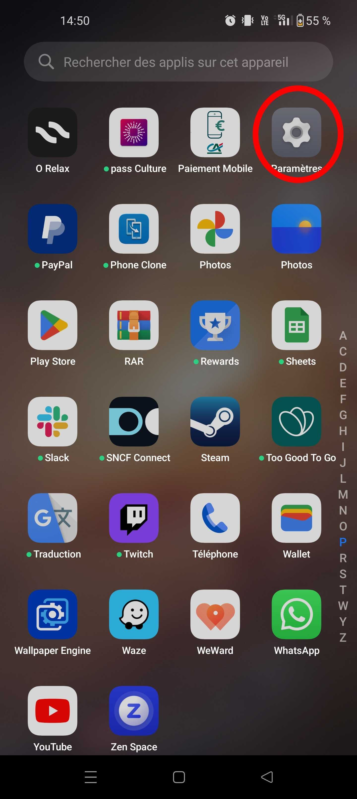
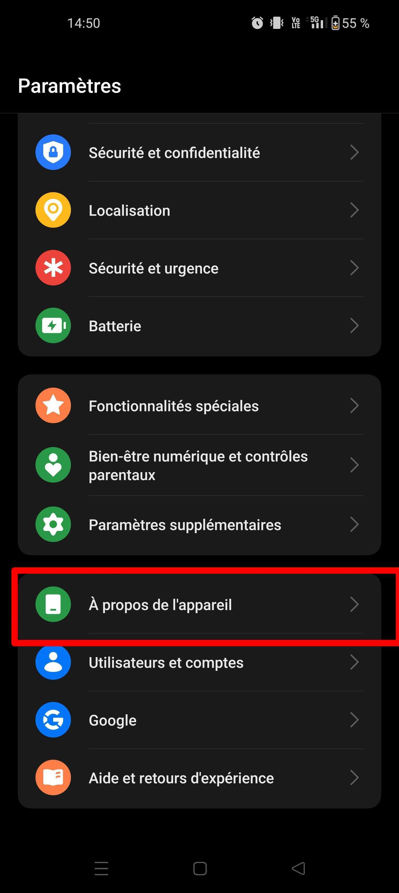
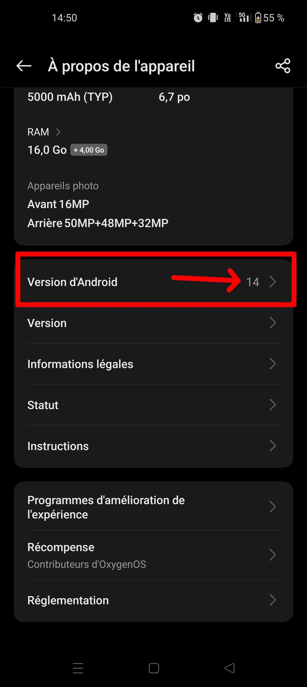

# Guide d'utilisation de Adopte1Candidat

## Sommaire

- [Guide d'utilisation de Adopte1Candidat](#guide-dutilisation-de-adopte1candidat)
  - [Sommaire](#sommaire)
  - [Introduction](#introduction)
    - [Mise en contexte](#mise-en-contexte)
    - [Éligibilité](#éligibilité)
      - [Vérifier son éligibilité](#vérifier-son-éligibilité)
        - [Savoir sa version d'Android](#savoir-sa-version-dandroid)
  - [Installation de l'application](#installation-de-lapplication)
  - [Premiers pas](#premiers-pas)
    - [Création de votre compte](#création-de-votre-compte)
    - [Connexion à votre compte](#connexion-à-votre-compte)

## Introduction

Vous trouverez dans ce manuel d'instructions toutes les informations nécessaires pour utiliser Adopte1Candidat.
De la création de votre compte à la publication de vos offres d'emploi, en passant par la recherche de candidats ou d'entreprise, vous saurez tout sur le fonctionnement de notre aplication.

### Mise en contexte

Vous êtes une personne à la recherche d'un emploi, mais pour qui les solutions classiques ne fonctionnent pas ou alors vous êtes une entreprise mais vous peinez à recruter des gens compétents ? Alors Adopte1Candidat est fait pour vous !

Adopte1Candidat est une application mobile qui matche les candidats et les entreprises en fonction de leurs compétences et de leurs besoins. Grâce à notre algorithme de matching, nous vous proposons des candidats ou des entreprises qui correspondent à vos critères de recherche.

Notre application est simple d'utilisation et intuitive. Vous n'avez qu'à créer un compte, renseigner vos informations et vos critères de recherche, et vous pourrez commencer à utiliser notre application.

### Éligibilité

Pour pouvoir accéder à notre application, vous devez avoir un ordinateur avec une connexion internet.
Si jamais vous souhaitez utiliser notre application sur votre smartphone, assurez-vous d'avoir une connexion internet et que l'appareil soit dans une des versions suivantes :

- Android 10 ou plus récent
- iOS 11 ou plus récent

#### Vérifier son éligibilité

Pour vérifier si votre appareil est compatible avec notre application, suivez les étapes suivantes :

##### Savoir sa version d'Android

Pour savoir quelle version d'Android vous avez, suivez les étapes suivantes :

1. Ouvrez l'application `Paramètres` de votre appareil.

   

2. Faites défiler l'écran jusqu'à trouver l'option `À propos de l'appareil`.

   

3. Faites défiler l'écran jusqu'à trouver l'option `Version d'Android`.
4. La version de votre appareil s'affichera dans le champ `Version d'Android`.

   

## Installation de l'application

Une fois que vous avez vérifié que votre appareil est compatible avec notre application, vous pouvez la télécharger sur le [Google Play Store](https://play.google.com/store) ou sur l'[App Store](https://www.apple.com/ca/fr/app-store/) en cherchant "Adopte1Candidat".

## Premiers pas

### Création de votre compte

Pour créer votre compte, suivez les étapes suivantes :

1. Ouvrez l'application en cliquant sur l'icône dans votre menu d'applications.
2. S'il s'agit de votre première utilisation de l'application sur cet appareil, vous devrez accepter les conditions d'utilisation et la politique de confidentialité.
3. Renseignez les informations suivantes :

   - Nom complet;
   - Adresse courriel;
   - Mot de passe; (pour des raisons de sécurité, nous vous recommandons de choisir un mot de passe d'au moins 12 caractères, contenant des lettres majuscules et minucules, des chiffres et des caractères spéciaux)
   - Répétez le mot de passe.
   - Cochez la case correspondante à votre situation actuelle : `Je suis un candidat` ou `Je suis une entreprise`.
   - Cliquez ensuite sur le bouton `S'inscrire`.

4. Vous êtes maintenant connecté à votre compte et vous pouvez commencer à utiliser l'application.

<!-- TODO: Insert image related to the sign in page -->

### Connexion à votre compte

Si vous avez déjà un compte, vous pouvez vous connecter en suivant les étapes suivantes :

1. Ouvrez l'application en cliquant sur l'icône dans votre menu d'applications.
2. S'il s'agit de votre première utilisation de l'application sur cet appareil, vous devrez accepter les conditions d'utilisation et la politique de confidentialité.
3. Au lieu de saisir vos informations, cliquez sur le bouton `Se connecter` situé en bas de l'écran, sous le bouton `S'inscrire`.
4. Renseignez les informations suivantes :

   - Adresse courriel;
   - Mot de passe;
   - Cliquez ensuite sur le bouton `Se connecter`.

5. Vous êtes maintenant connecté à votre compte et vous pouvez commencer à utiliser l'application.
