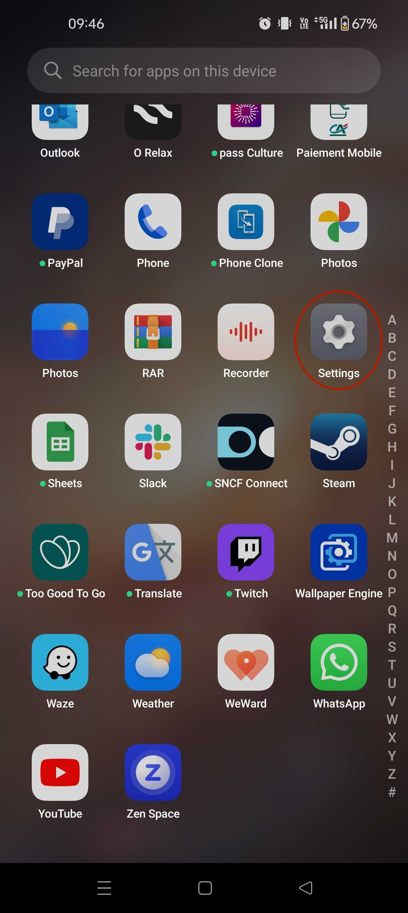
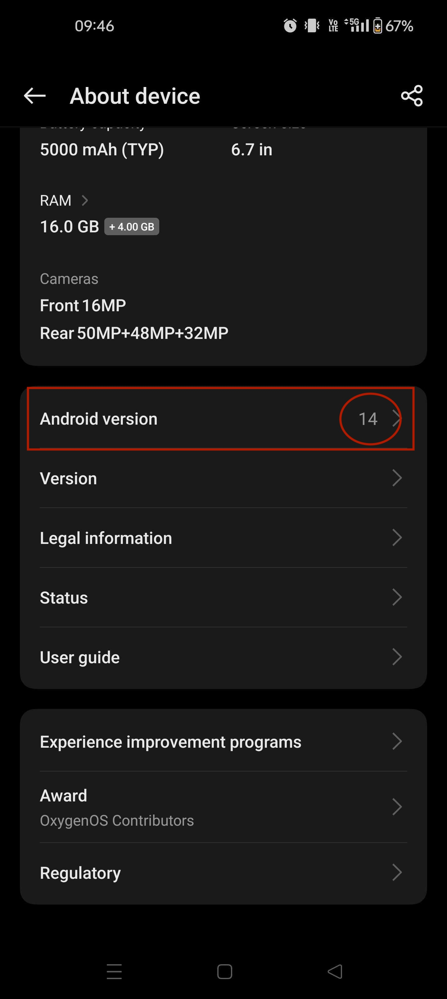
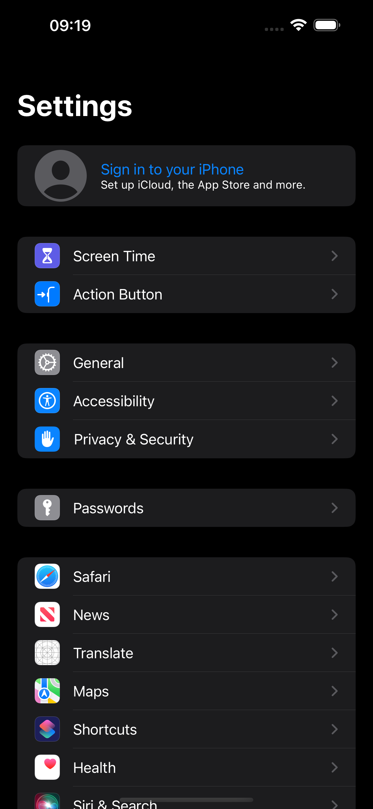
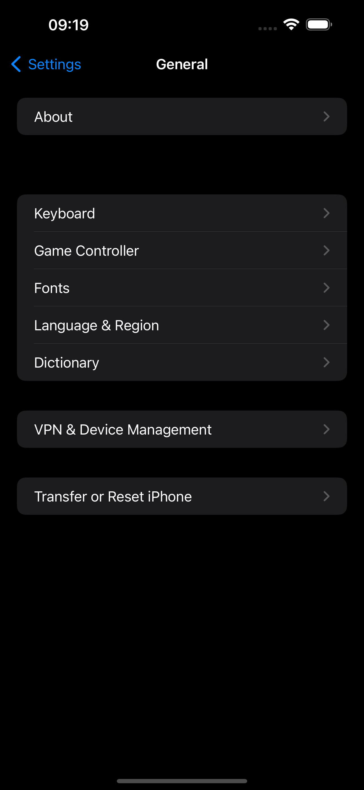
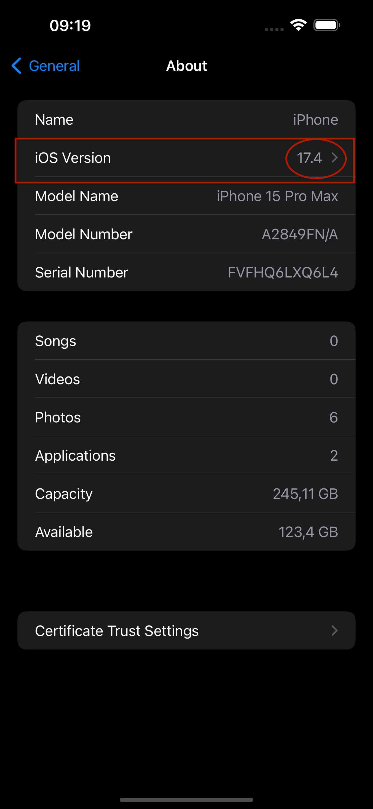
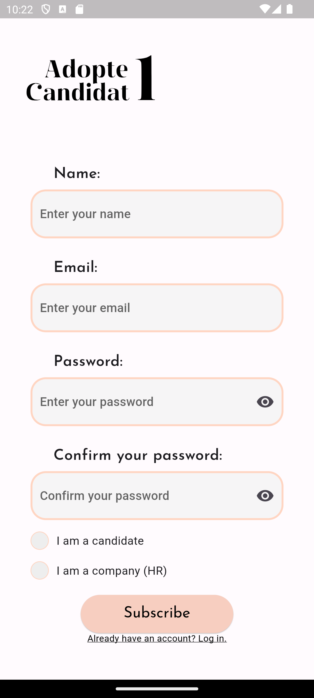
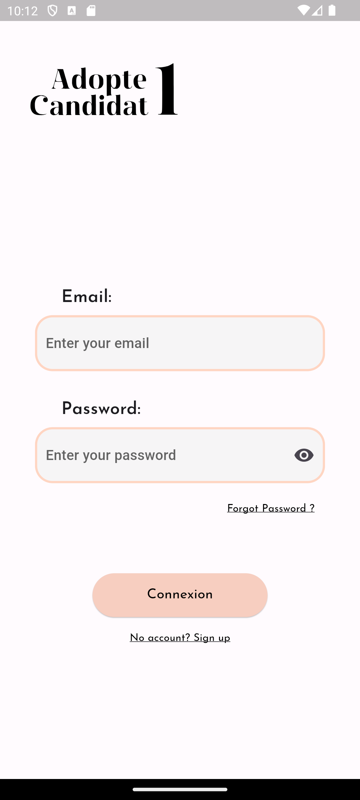

# Adopte1Candidat User Manual

## Contents

- [Adopte1Candidat User Manual](#adopte1candidat-user-manual)
  - [Contents](#contents)
  - [Introduction](#introduction)
    - [Background](#background)
    - [Eligibility](#eligibility)
      - [Check eligibility](#check-eligibility)
        - [Know your Android version](#know-your-android-version)
        - [Know your iOS version](#know-your-ios-version)
  - [Installing the application](#installing-the-application)
  - [First steps](#first-steps)
    - [Creating your account](#creating-your-account)
    - [Login to your account](#login-to-your-account)
  - [Create your profile](#create-your-profile)
  - [Matching system](#matching-system)

## Introduction

In this instruction manual, you'll find all the information you need to use Adopte1Candidat.
From creating your account to publishing your job offers and finding candidates or companies, you'll find out everything you need to know about how our application works.

### Background

Are you a person looking for a job, but for whom conventional solutions don't work? Or are you a company struggling to recruit the right people? Then Adopte1Candidat is for you!

Adopte1Candidat is a mobile application that matches candidates and companies according to their skills and needs. Thanks to our matching algorithm, we propose candidates or companies that match your search criteria.

Our application is easy to use and intuitive. Simply create an account, enter your details and search criteria, and you're ready to go.

### Eligibility

To access our application, you need a computer with an internet connection.
If you ever want to use our application on your smartphone, make sure you have an internet connection and that the device is in one of the following versions:

- Android 10 or later
- iOS 11 or later

#### Check eligibility

To check whether your device is compatible with our application, follow these steps:

##### Know your Android version

To find out which Android version you have, follow these steps:

1. Open the `Settings` application on your device.

 

2. Scroll down until you find the `About Device` option.

 

3. Scroll down until you find the `Android version` option.
4. The version of your device will be displayed in the `Android version` field.

 

##### Know your iOS version

To find out which iOS version you have, follow these steps:

1. Open the `Settings` application on your device.

 

2. Scroll down until you find the `General` option.

 

3. Scroll down until you find the `About` option.

 

4. Your device version will be displayed in the `iOS Version` field.

 

## Installing the application

Once you've checked that your device is compatible with our app, you can download it from the [Google Play Store](https://play.google.com/store) or the [App Store](https://www.apple.com/ca/fr/app-store/) by searching for "Adopte1Candidat".

## First steps

### Creating your account

To create your account, follow these steps:

1. Open the application by clicking on the icon in your applications menu.
2. If this is your first time using the application on this device, you will need to accept the terms of use and privacy policy.
3. Fill in the following information:

   - Full name;
   - e-mail address
   - Password (for security reasons, we recommend a password of at least 12 characters, containing upper and lower case letters, numbers and special characters).
   - Repeat the password.
   - Check the box corresponding to your current situation: `I am a candidate` or `I am a company`.
   - Then click on the `Register` button.

  

4. You are now logged in to your account and can start using the application.

### Login to your account

If you already have an account, you can log in by following these steps:

1. Open the application by clicking on the icon in your applications menu.
2. If this is your first time using the application on this device, you will need to accept the terms of use and privacy policy.
3. Instead of entering your details, click on the `Login` button at the bottom of the screen, below the `Register` button.
4. Fill in the following information:

   - E-mail address;
   - Password;
   - Then click on the `Login` button.

  

5. You are now connected to your account and can start using the application.

## Create your profile

<!-- TODO -->

## Matching system

Once your profile has been created, you can access the matching system. This will then suggest candidates or companies that match your search criteria.

When you arrive on the matching page, you'll see a sheet presenting a candidate or a company. You can then :

- Consult the information in the file by reading the different sections;
- Drag the file to the left to reject the candidate or company, thus moving on to the next file;
   <!-- TODO: Insert switch -->
- Drag to the right to accept the candidate or company, thus moving on to the next form.

To help the user avoid mistakes, the background colour changes according to the action performed. If the user rejects the file, the background turns red, and if the user tends to accept the file, the background turns green.
